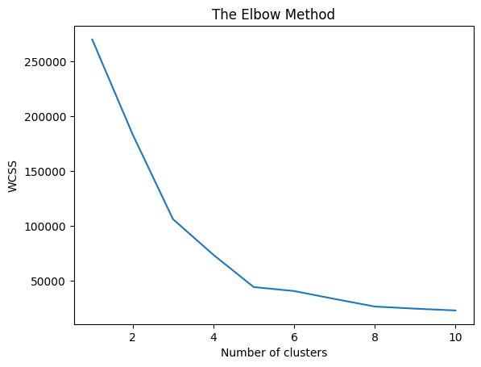
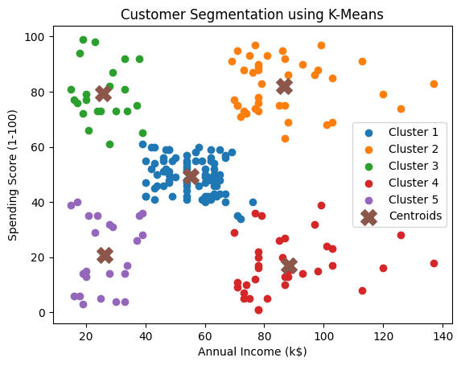

# Implementation-of-K-Means-Clustering-for-Customer-Segmentation

## AIM:
To write a program to implement the K Means Clustering for Customer Segmentation.

## Equipments Required:
1. Hardware – PCs
2. Anaconda – Python 3.7 Installation / Jupyter notebook

## Algorithm
1.Import dataset and print head,info of the dataset

2.check for null values

3.Import kmeans and fit it to the dataset

4.Plot the graph using elbow method

5.Print the predicted array

6.Plot the customer segments

## Program:
```
/*
Program to implement the K Means Clustering for Customer Segmentation.
Developed by: SUDHARSAN S
RegisterNumber: 212224040334
*/
```
```
import numpy as np
import pandas as pd
import matplotlib.pyplot as plt
from sklearn.cluster import KMeans

data = pd.read_csv("Mall_Customers.csv")

print(data.head())
print(data.info())
print(data.isnull().sum())

X = data.iloc[:, [3, 4]].values

wcss = []
for i in range(1, 11):
    kmeans = KMeans(n_clusters=i, init='k-means++', random_state=42)
    kmeans.fit(X)
    wcss.append(kmeans.inertia_)

plt.figure()
plt.plot(range(1, 11), wcss)
plt.title('The Elbow Method')
plt.xlabel('Number of clusters')
plt.ylabel('WCSS')
plt.show()

kmeans = KMeans(n_clusters=5, init='k-means++', random_state=42)
y_pred = kmeans.fit_predict(X)

print(y_pred)

plt.figure()
plt.scatter(X[y_pred == 0, 0], X[y_pred == 0, 1], label="Cluster 1")
plt.scatter(X[y_pred == 1, 0], X[y_pred == 1, 1], label="Cluster 2")
plt.scatter(X[y_pred == 2, 0], X[y_pred == 2, 1], label="Cluster 3")
plt.scatter(X[y_pred == 3, 0], X[y_pred == 3, 1], label="Cluster 4")
plt.scatter(X[y_pred == 4, 0], X[y_pred == 4, 1], label="Cluster 5")
plt.scatter(kmeans.cluster_centers_[:, 0], kmeans.cluster_centers_[:, 1],
            s=200, marker='X', label="Centroids")
plt.title("Customer Segmentation using K-Means")
plt.xlabel("Annual Income (k$)")
plt.ylabel("Spending Score (1-100)")
plt.legend()
plt.show()

```

## Output:
head:


info:


isnull:


plt:



y_pred:


segment:




## Result:
Thus the program to implement the K Means Clustering for Customer Segmentation is written and verified using python programming.